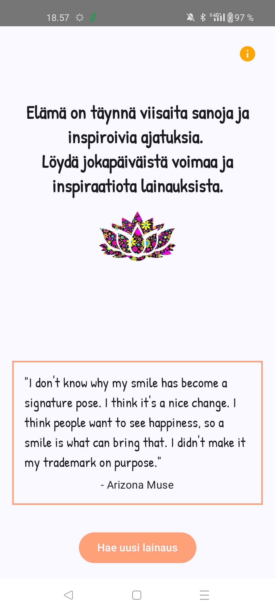

# Quotes App

Tämä sovellus tarjoaa käyttäjilleen päivittäisiä lainauksia inspiroivista ajattelijoista. 
## Ominaisuudet

- **Lainauksien hakeminen**: Käyttäjä voi hakea uusia lainauksia napauttamalla painiketta.
- **Info-näyttö**: Käyttäjät voivat siirtyä infonäyttöön saadakseen lisätietoja sovelluksesta.

# Projektin Esittely

## Päänäyttö

## Info-näyttö

## Teknologiat

- **Kotlin**: Pääohjelmointikieli.
- **Jetpack Compose**: UI-kirjasto.
- **Coil**: Kuvakirjasto kuvien lataamiseen.

